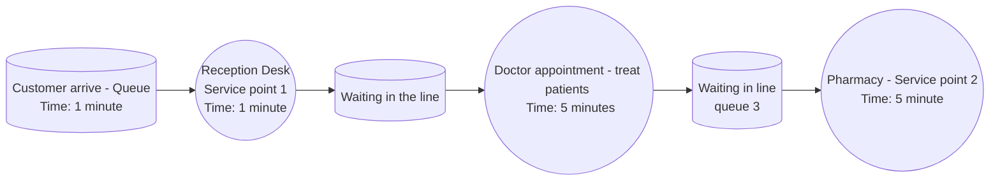
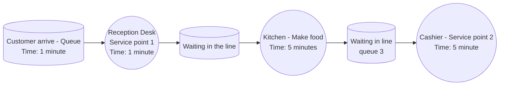

## Orientation Task 4_3 

### QUESTION
Design two different systems of three or four service points for a real-world destination. Use real-world concepts.
Draw diagrams using the graphical representation of a service point shown in section ´Performance Variables´.

### ANSWER
In this question, two different systems will be used (Hospital and restaurant)
**The diagram of Hospital:**

- Hospital
    + Customer arrive at the hospital and wait (queue)
    + The customer move to the reception desk and receive their order (service point 1)
    + The customer move to doctor's office and the doctor will treat the customer (service point 2)
    + The customer will then go to pharmacy to receive medicine based on the list that the doctor gave them
      (service point 3)
    + The customer will leave once they have the medicine (exit)

-----------------------------

**The diagram of Restaurant:**

- Restaurant
    + The customer arrive at the restaurant and wait (queue)
    + The waiter will come and get the customer's order (service point 1)
    + The kitchen will make food based on the customer's order (service point 2)
    + Once the customer finish their food, they will go to the reception area to pay money (service point 3)
    + Once finish, the customer will leave (exit)
  

